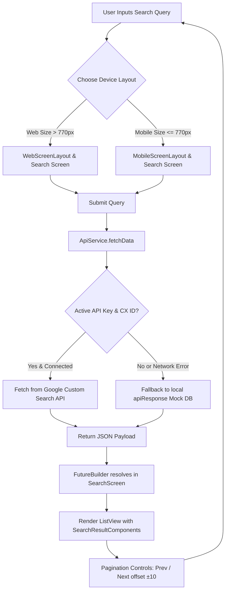

# 🚀 Google Clone App — Responsive Flutter Search Engine

A high-fidelity, production-grade, and pixel-perfect dark-mode recreation of the **Google Search Engine** interface built from the ground up using **Flutter**. Powered by the official **Google Custom Search JSON API** with robust offline mock-data fallbacks, the application showcases adaptive layout design, pagination, category tabs, and complex UI replication for web, tablet, and mobile platforms.

---

## 🌟 Key Features

*   **📱 Universal Adaptability & Responsiveness**: Adapts dynamically across mobile, tablet, and desktop monitors. Built with a custom `LayoutBuilder` wrapper (`<= 770px` breakpoint) that loads separate tailored UI layouts (`MobileScreenLayout` vs. `WebScreenLayout`).
*   **🔍 Live Google Custom Search API Integration**: Performs real-time search queries by contacting the official Google Custom Search JSON API backend.
*   **💾 Graceful Local Mock Fallback**: Includes a robust fallback mechanism using a pre-configured database (`api_json.dart`). If network calls fail, limits are reached, or API keys are omitted, the app transitions seamlessly to load rich mock results, preserving full interactivity.
*   **🔢 Off-set Based Infinite Pagination**: Implements full query pagination allowing users to step backward or forward through search results (`10` results per page) by updating page offsets dynamically.
*   **🗂️ Google-Faithful Category Search Tabs**: Features category navigation matching Google's search toolbar (including *All, Images, Videos, News, Maps, Shopping, and More*).
*   **🎨 True HSL/RGB Dark Mode Design**: Uses a custom color palette derived exactly from Google's actual dark mode specifications (`#202124` Canvas background, `#303134` Search input background, and `#8AB4F8` Link blue accent).

---

## 🛠️ How It Works (The Search Flow)

The application handles query entry, backend resolution, and responsive rendering according to this structured workflow:



---

## 📁 Codebase Architecture

The project maintains a clean, scalable folder structure that isolates responsive layouts, UI widgets, network services, and local configurations:

```bash
lib/
├── Responsive/
│   ├── Mobile_Footer.dart             # Responsive footer tailored for small screen sizes
│   ├── mobile_screen_layout.dart       # Layout scaffold for mobile-sized devices
│   ├── responsive_layout_screen.dart   # Main LayoutBuilder to route layout resolutions
│   └── web_screen_layout.dart          # Layout scaffold for web/desktop screens
├── colors.dart                         # Google Dark Mode color system tokens
├── main.dart                           # Application entry point & ThemeData.dark setup
├── config/
│   ├── api_json.dart                   # Rich offline fallback JSON mock search database
│   └── api_keys.dart                   # Secure placeholders for your Custom Search APIs
├── screens/
│   └── search_screen.dart              # Search Results Page with ListView & pagination
├── services/
│   └── api_service.dart                # HTTP engine querying Google APIs / fallbacks
└── widgets/
    ├── Search_Result_Component.dart    # Individual search item with titles, URLs, and descriptions
    ├── Search_tabs.dart                # Parent horizontal list of all Search Category tabs
    ├── search_tab.dart                 # Indivudual search category item with SVG asset
    ├── Translation_buttons.dart        # "Google offered in..." multi-language options
    ├── footer_text.dart                # Localized footer anchor links
    ├── language_text.dart              # Custom styling for translations
    ├── search.dart                     # Main search-input controller with Google branding logo
    ├── search_footer.dart              # Dynamic footer rendered below search results
    └── web/
        ├── search_button.dart          # Standard Google flat buttons
        ├── search_buttons.dart         # Wrapper grouping "Google Search" and "I'm Feeling Lucky"
        └── web_footer.dart             # Desktop footer displaying locations and settings links
```

---

## 🔑 Setting Up Google Custom Search API

To connect the application to live Google Search indices, you will need a **Google Custom Search Engine ID (CX)** and a **Google Developer API Key**. Follow these simple steps to configure them:

### Step 1: Create a Custom Search Engine (CX)
1. Go to the [Google Programmable Search Engine Control Panel](https://programmable-search-engine.google.com/).
2. Click **Add** to create a new search engine.
3. In the setup wizard, name your search engine and choose **"Search the entire web"** or target specific domains.
4. Copy the **Search Engine ID (CX)** provided in the console.

### Step 2: Generate a Google Developers Custom Search API Key
1. Go to the [Google Cloud Console API & Services](https://console.cloud.google.com/).
2. Create or select a project.
3. Search for and enable the **Custom Search API**.
4. Navigate to the **Credentials** page and click **Create Credentials -> API Key**.
5. Copy the generated **API Key**.

### Step 3: Insert Keys into the Codebase
Open the `lib/config/api_keys.dart` file and replace the string constants with your verified values:

```dart
// lib/config/api_keys.dart

// Your Google Developer Console Custom Search API Key
const String apikey = "YOUR_GOOGLE_API_KEY_HERE";

// Your Google Custom Search Engine ID (CX Key)
const String contextKey = "YOUR_CUSTOM_SEARCH_ENGINE_ID_HERE";
```

> [!TIP]
> Keep `isDummyData` in `lib/services/api_service.dart` set to `false` to pull live internet data. Set it to `true` to force offline mock behavior for manual UI testing without incurring API quota usage.

---

## 📥 Installation & Running Guide

Follow these steps to set up and run the Google Clone App locally on your machine.

### Prerequisites
*   [Flutter SDK](https://docs.flutter.dev/get-started/install) installed on your machine (`version >= 3.4.4 < 4.0.0`).
*   Google Chrome (or any web browser supporting Flutter Web).
*   iOS Simulator or Android Emulator (if running on mobile devices).

### Step 1: Clone the Repository
Open your terminal or command prompt and clone the repository:
```bash
git clone https://github.com/Rohanranga/Google_Clone_App.git
cd Google_Clone_App
```

### Step 2: Install Project Dependencies
Run the standard package manager command to fetch all required libraries (e.g. `flutter_svg`, `http`, `url_launcher`):
```bash
flutter pub get
```

### Step 3: Run the Application

*   **To run on Web (Google Chrome):**
    ```bash
    flutter run -d chrome
    ```

*   **To run on a Mobile Device / Emulator:**
    ```bash
    flutter run
    ```

### Step 4: Build a Production Web Bundle (Optional)
If you wish to compile the application into standard HTML/JS/CSS assets ready for deployment (e.g., Firebase Hosting, GitHub Pages):
```bash
flutter build web --release
```
The compiled output will be generated inside the `build/web/` directory.

---

## 🎨 UI & Color System Token Breakdown

The application maintains a rigid dark-mode look corresponding to real-world specifications defined in `lib/colors.dart`:

| Token Name | Color Space (RGB) | Description |
| :--- | :--- | :--- |
| `backgroundColor` | `Color.fromRGBO(32, 33, 36, 1)` | Scaffold background canvas color (Google Charcoal `#202124`) |
| `searchColor` | `Color.fromRGBO(48, 49, 52, 1)` | Inset text entry background block (`#303134`) |
| `blueColor` | `Color.fromRGBO(138, 180, 248, 1)` | Custom hyperlink and tab highlight color (Google Ice Blue `#8ab4f8`) |
| `searchBorder` | `Color.fromRGBO(95, 99, 104, 1)` | Input field focus border and icon tone |
| `primaryColor` | `Colors.white` | Standard foreground text color |
| `footerColor` | `Color.fromRGBO(23, 23, 23, 1)` | Footer canvas bar background (`#171717`) |

---

## 🔗 Technical Dependencies

The app relies on the following lightweight packages to drive network request operations, deep link redirection, and vectorized logo graphics:

*   **`flutter_svg`** (`^2.0.10+1`): Loads and displays resolution-independent icons for search tools, microphones, and grids.
*   **`http`** (`^1.2.2`): The HTTP client handling API queries to Google's Custom Search server.
*   **`url_launcher`** & **`url_launcher_android`** (`^6.3.0`): Launches search results links in the device's native external web browser.

---

## 🤝 Contributing

Contributions are welcome! Please follow these guidelines:
1. Fork this repository.
2. Create a branch: `git checkout -b feature/awesome-feature`
3. Commit your changes: `git commit -m 'Add awesome feature'`
4. Push to the branch: `git push origin feature/awesome-feature`
5. Submit a detailed Pull Request.

## 📄 License

This project is licensed under the MIT License. See the [LICENSE](LICENSE) file for more information.
